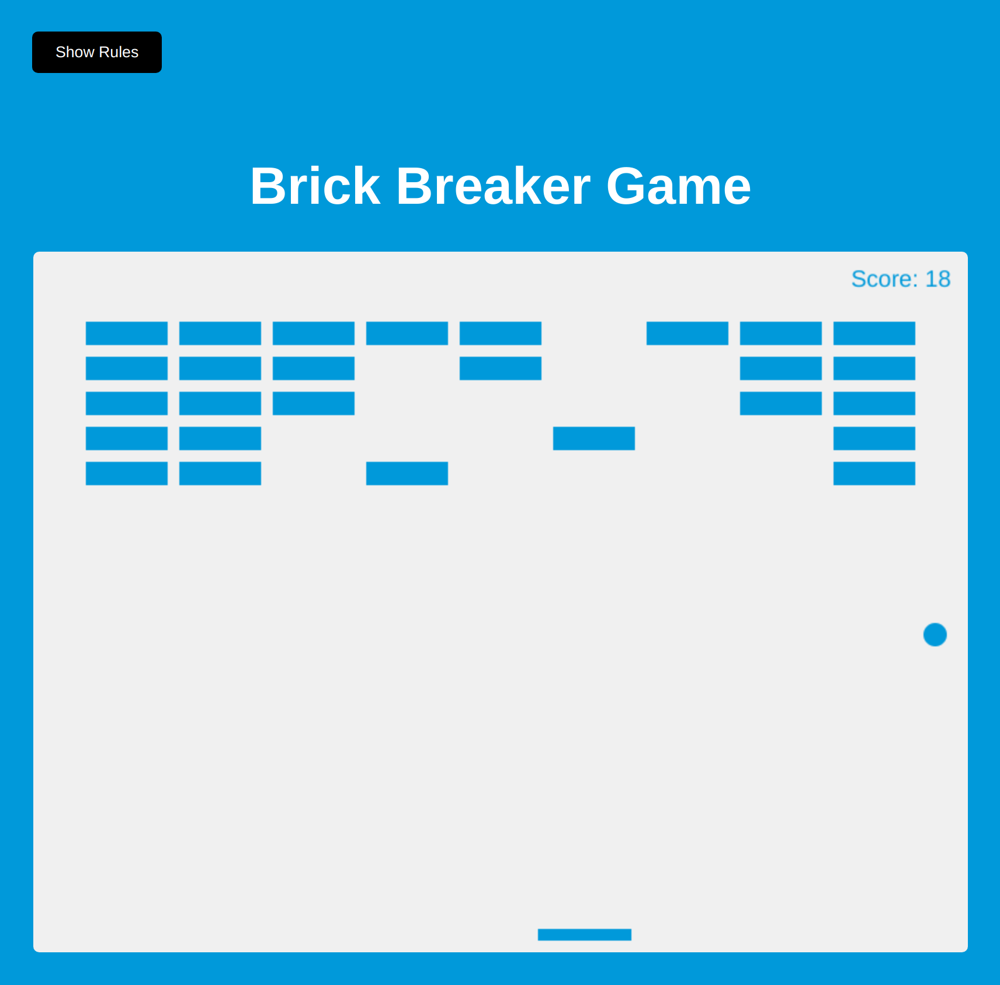

# brick-breaker-game

A simple Brick Breaker Game, built using canvas and JavaScript

### Functions:

[The app](https://tn-space.github.io/brick-breaker-game/)

The app:

- toggle 'Show Rules' button
- disappear a brick on hit, keep score
- reset the game and score if the padde misses the ball (ball hit bottom boundary)

### Images:

